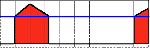

# threshold

这次学习OpenCV2.14中的阈值(threshold)函数： [threshold](http://opencv.willowgarage.com/documentation/cpp/miscellaneous_image_transformations.html#cv-threshold) 的运用。 

## 原理

### 阀值

- 最简单的图像分割的方法。

- 应用举例：从一副图像中利用阈值分割出我们需要的物体部分（当然这里的物体可以是一部分或者整体）。这样的图像分割方法是基于图像中物体与背景之间的灰度差异，而且此分割属于像素级的分割。

- 为了从一副图像中提取出我们需要的部分，应该用图像中的每一个像素点的灰度值与选取的阈值进行比较，并作出相应的判断。（注意：阈值的选取依赖于具体的问题。即：物体在不同的图像中有可能会有不同的灰度值。

- 一旦找到了需要分割的物体的像素点，我们可以对这些像素点设定一些特定的值来表示。（例如：可以将该物体的像素点的灰度值设定为：‘0’（黑色）,其他的像素点的灰度值为：‘255’（白色）；当然像素点的灰度值可以任意，但最好设定的两种颜色对比度较强，方便观察结果）。

<div align=center>
   
</div>

### 阈值化的类型

- OpenCV中提供了阈值（threshold）函数： [threshold](http://opencv.willowgarage.com/documentation/cpp/miscellaneous_image_transformations.html#cv-threshold) 。

- 这个函数有5种阈值化类型，在接下来的章节中将会具体介绍。

- 为了解释阈值分割的过程，我们来看一个简单有关像素灰度的图片，该图如下。该图中的蓝色水平线代表着具体的一个阈值。

<div align=center>
   
</div>

  #### 阀值类型1：二进制阈值化

  - 该阈值化类型如下式所示:

<div align=center>

</div>

  - 解释：在运用该阈值类型的时候，先要选定一个特定的阈值量，比如：125，这样，新的阈值产生规则可以解释为大于125的像素点的灰度值设定为最大值(如8位灰度值最大为255)，灰度值小于125的像素点的灰度值设定为0。

<div align=center>
 
</div>
  

  #### 阀值类型2：反二进制阈值化

  - 该阈值类型如下式所示：

<div align=center>

</div>

  - 解释：该阈值化与二进制阈值化相似，先选定一个特定的灰度值作为阈值，不过最后的设定值相反。（在8位灰度图中，例如大于阈值的设定为0，而小于该阈值的设定为255）。

<div align=center>
 
</div>
  

  #### 阈值类型3：截断阈值化

  - 该阈值化类型如下式所示：

<div align=center>

</div>

  - 解释：同样首先需要选定一个阈值，图像中大于该阈值的像素点被设定为该阈值，小于该阈值的保持不变。（例如：阈值选取为125，那小于125的阈值不改变，大于125的灰度值（230）的像素点就设定为该阈值）。

<div align=center>
 
</div>
  

  #### 阈值类型4：阈值化为0

  - 该阈值类型如下式所示：

<div align=center>

</div>

  - 解释：先选定一个阈值，然后对图像做如下处理：1 像素点的灰度值大于该阈值的不进行任何改变；2 像素点的灰度值小于该阈值的，其灰度值全部变为0。

<div align=center>
 
</div>
  

  #### 阈值类型5：反阈值化为0

  - 该阈值类型如下式所示：

<div align=center>

</div>

  - 解释：原理类似于0阈值，但是在对图像做处理的时候相反，即：像素点的灰度值小于该阈值的不进行任何改变，而大于该阈值的部分，其灰度值全部变为0。

<div align=center>
 
</div>


## 代码解释

先看一下整个程序的结构：

- 先读取一副图片，如果是图片颜色类型是RGB3色类型，则转换成灰度类型的图像。转换颜色类型可以运用OpenCV中的 cvtColor<> 函数。

  ```C++
  src = imread("cat.jpg", 1);
  // 将图片转换成灰度图片
  cvtColor(src, src_gray, CV_RGB2GRAY);
  ```

- 然后创建一个窗口来显示该图片可以检验转换结果

  ```C++
  namedWindow(window_name, CV_WINDOW_AUTOSIZE);
  ```

- 接着该程序创建两个滚动条来等待用户的输入：

  - 第一个滚动条作用：选择阈值类型：1：二进制； 2：反二进制； 3：截断； 4：0； 5：反0。
  - 第二个滚动条作用：选择阈值的大小。

  ```C++
  createTrackbar("Type",
  		window_name, &threshold_type,
  		max_type, Threshold_Demo);
  
  	createTrackbar("Value",
  		window_name, &threshold_value,
  		max_value, Threshold_Demo);
  ```

- 在这里等到用户拖动滚动条来输入阈值类型以及阈值的大小，或者是用户键入ESC健退出程序。

- 无论何时拖动滚动条，用户自定义的阈值函数都将会被调用。

  ```C++
  void Threshold_Demo(int, void*)
  {
  	/* 0: 二进制阈值
  	1: 反二进制阈值
  	2: 截断阈值
  	3: 0阈值
  	4: 反0阈值
  	*/
  	threshold(src_gray, dst, threshold_value, max_BINARY_value, threshold_type);
  	imshow(window_name, dst);
  }
  ```

  就像你看到的那样，在这样的过程中，函数 threshold<> 会接受到5个参数：

  - *src_gray*: 输入的灰度图像的地址。
  - *dst*: 输出图像的地址。
  - *threshold_value*: 进行阈值操作时阈值的大小。
  - *max_BINARY_value*: 设定的最大灰度值（该参数运用在二进制与反二进制阈值操作中）。
  - *threshold_type*: 阈值的类型。从上面提到的5种中选择出的结果。